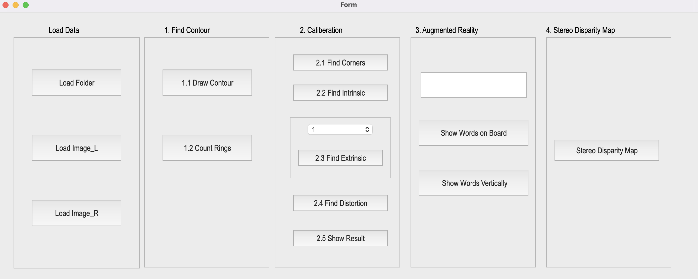
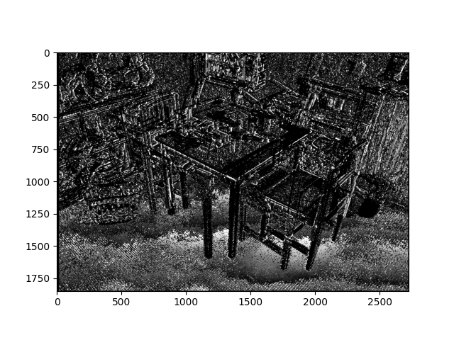

# OpenCV-Computer-Vision Practice third

*Discription:*

***1.This is just a small project that we want to practice the camera calibration and stereo vision for 3D reconstruction.***
***2.This topic focuses on image processing to find image contours,calibrate chessboards,create simple AR,and reconstruct reality using stereo vision.***

**1.Requirements and dependencies**
  * Python 3.7 (https://www.python.org/downloads/)
  * Opencv-contrib-python (3.4.2.17)
  * Matplotlib 3.1.1
  * UI framework: pyqt5 (5.15.1)

**2.Usage:**

1. Downloads whole repository.
2. Run `python start.py` .
3. Input the image.
4. Run the whole code.

**3.Feature:**

1.Find contour

* 1.1 Draw contour :
  
    * Detection the RGB image [img1.jpg](Q1_Image/img1.jpg) contour.
      
* 1.2 Count rings :
  
    * Counting the image [img2.jpg](Q1_Image/img2.jpg) ring numbers.

2.Camera calibration

* 2.1 Find chessboard corners:
  
   * Find and draw the corners on the chessboard for each image.
   * Click button `2.1` to show each picture 0.5 seconds.

https://github.com/Kung-hen/Camera-Calibration-and-Stereo/assets/95673520/a324cea7-c4d6-47d5-8211-7f14880b1c67

* 2.2 Find Intrinsic matrix:
  
   * Find the intrinsic matrix.
   * Click button `2.2` and then show the result on the console 

* 2.3 Find Extrinsic matrix:
  
   * From give Intrinsic parameters, distortion coefficients, and the list of 15 images.
   * Find the extrinsic matrix of the chessboard for specfic of the 15 images, 

* 2.4 Find distortion:
  
   * Find the distortion matrix.
   * Click button `2.4` to show the result on the console window.

* 2.5 Processing result:
   
   * Undistort the chessboard images.
   * Click button `2.5` to show distorted and undistorted images

https://github.com/Kung-hen/Camera-Calibration-and-Stereo/assets/95673520/0e206824-81b7-4c71-9274-aeebaeb94fc8

3.Augmented reality (AR)

* 3.1 Show the word on board:
  
   * Calibrate 5 images to get intrinsic, distortion and extrinsic parameters.
   * Input a “Word” less than 6 char in English in the textEdit box.
   * Derive the shape of the “Word” by using the provided library.
   * Show the “Word” on the chessboards images(1.bmp to 5.bmp).
   * Show the “Word” vertically on the chessboards images(1.bmp to 5.bmp).
   * Click the button to show the “Word” on the picture. Show each picture for 1 second (total 5 images).

https://github.com/Kung-hen/Camera-Calibration-and-Stereo/assets/95673520/e90a1f40-5b44-49b4-9206-04159e2e50a7

* 3.2 Show words vertically:
  
   * Use OpenCV function to read and derive the array or matrix of the char.
   * Here take "K" in "alphabet_lib_onboard.txt" for example.
   * ‘K’ consist of 3 lines, so the "ch array" consists 3 pairs of 3D coordinates in Word Frame representing two ends of the line shown in the upper right image.
   * The chessboard x, y, z axis and (0,0,0) coordinate are shown in the bottom left image.
   * Each Char should be place in the order and position shown in the bottom right image.

https://github.com/Kung-hen/Camera-Calibration-and-Stereo/assets/95673520/ba3ec8ed-d9af-49cf-8de6-c27ca5d33dfa

4.Stereo disparity map

* 4.1 Show the map:
  
   * Find the disparity map/image based on Left and Right stereo images.
   * Click at left image and draw the corresponding dot at right image.

https://github.com/Kung-hen/Camera-Calibration-and-Stereo/assets/95673520/fd924873-95b0-454a-bb28-f0c5c20ee1e0

